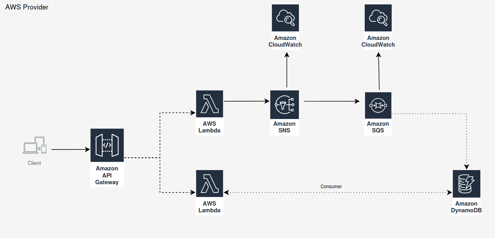

<h1>CallTI</h1>

O propósito do projeto é simular uma aplicação de abertura de chamados para os diversos times que tem numa empresa, seja o time de infra, o time de responsável pelo hardware, time de desenvolvimento, entre outros que podem vir a existir dependendo da regra de negócio da empresa.

A aplicação poderia ser desenvolvida facilmente sem nada relacionado a Cloud, porém para aprimorar os meus conhecimentos optei por simular uma infraestrutura com serviços da AWS e utilizar na minha aplicação. E para fazer isso optei por utilizar o serviço Localstack que simula uma infraestrutura com serviços da AWS localmente e de forma gratuita. 

***FLUXO DA APLICAÇÃO***

